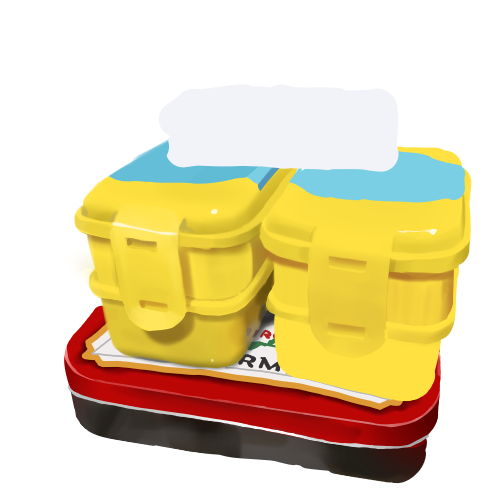
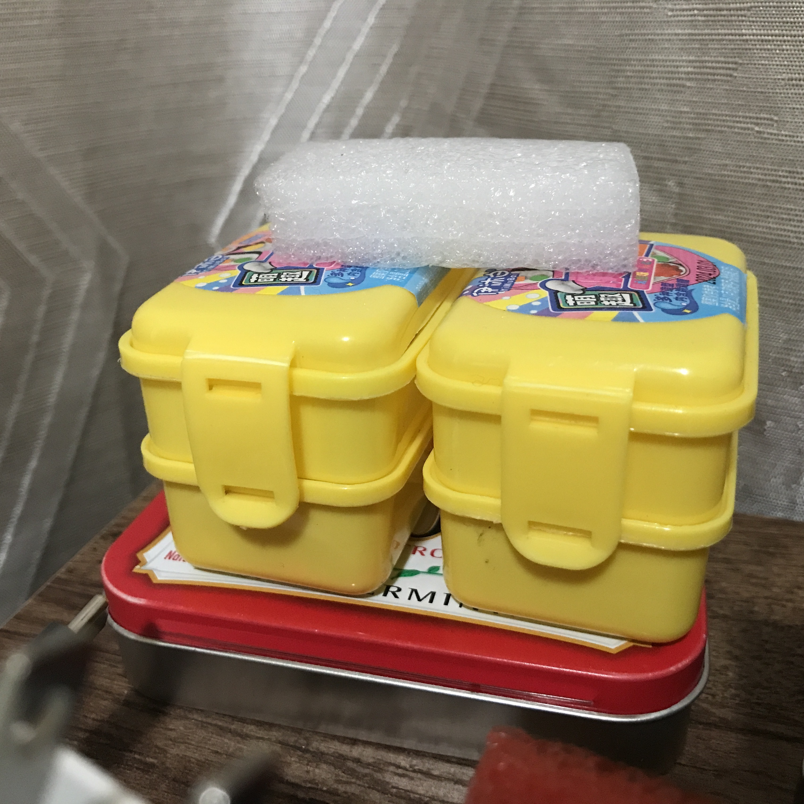
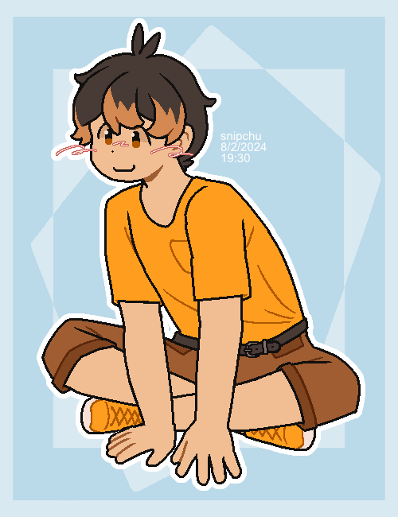
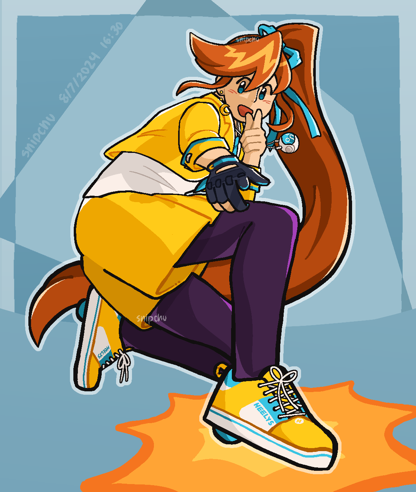
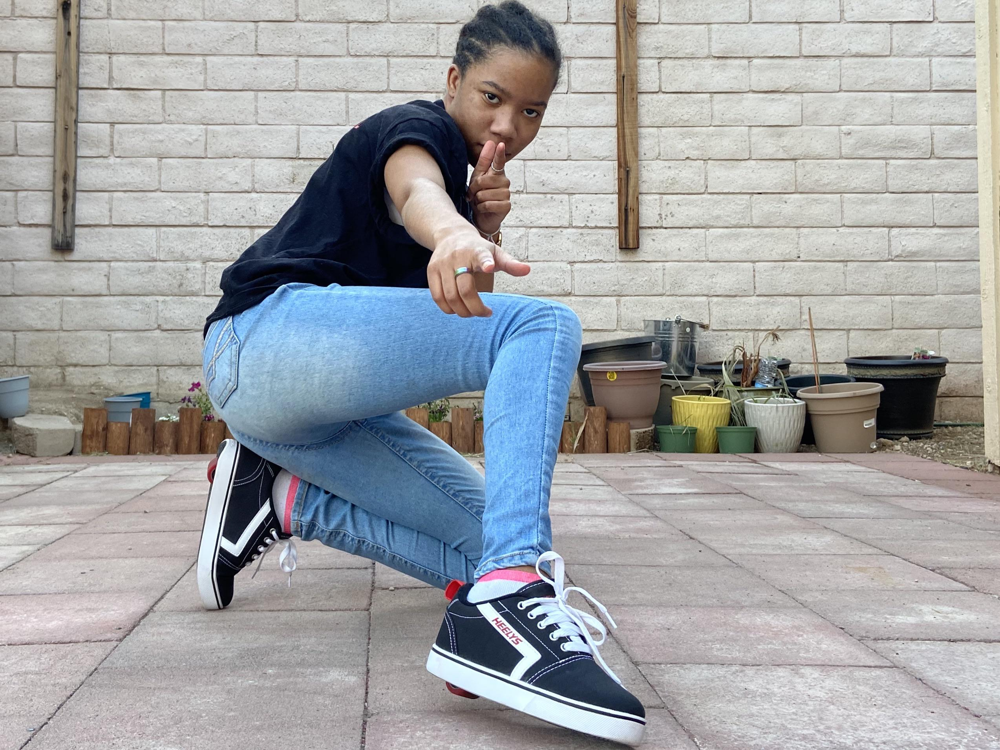

# arcade art corner
this is a github directory of all of my media made during hack club's arcade!

## sketch*.jpg
these are sketchbook drawings/studies!

* [sketch 1](sketch1.jpg): heads/hands/faces from artists online
* [sketch 2](sketch2.jpg): poses from artists online
* [sketch 3](sketch3.png): digital painting practice -- [kra file](sketch3.kra)
  *  
* [sketch 4](sketch4.png): pose study -- [process video](sketch4process.mp4)
  *  
* [sketch 5](sketch5.png): pose study 2 -- [kra file](sketch5.kra)
  *  
